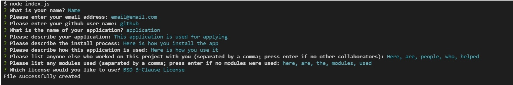

# Readme Generator

## Table of Contents
[Description](#description)

[Installation](#installation)

[Usage](#usage)

[Screenshots](#screenshots)

[Credits](#credits)

[Dependencies](#dependencies)

[Questions](#questions)

---

## Description
This app is used to quickly generate a formatted readme file from the terminal
                
---     
## Installation
Navigate your browser to https://github.com/AGarraffa/readme-generator and using git bash clone the repository to your desired directory. Then open the terminal (node.js required) and type "npm i" (without quotes) to install the required modules. 

---
## Usage
In the terminal type "node index.js" (without quotes) to run the app. Then you will be presented with a series of prompts. Upon completion a file called README.md will be created in the same directory as the original index.js

Please see the video in ./assets/video for a higher resolution version

    

---
## Credits
* Alfred Garraffa

---
## Dependencies
* inquirer 

---
## Questions
agarraffa@gmail.com

https://github.com/agarraffa

project is deplotyed at: https://github.com/AGarraffa/readme-generator

        
        
this file was created usings Alfred Garraffa's Readme generator